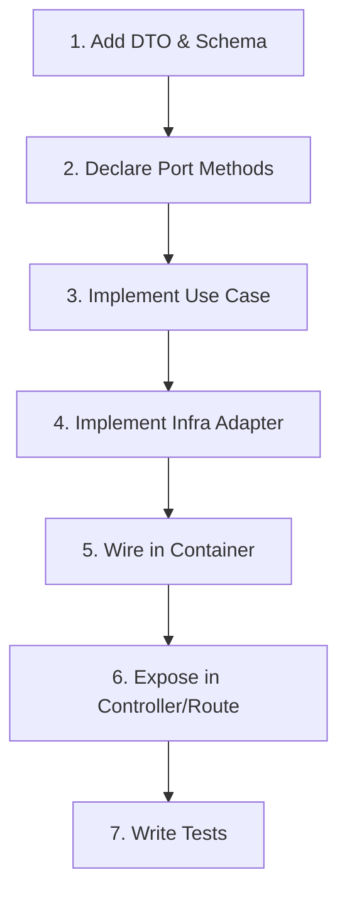

# System Architecture & Coding Standards

This document describes the architectural patterns, directories, and coding standards used across the **InterviewPrep Platform**. Any agent or developer adding new features must strictly adhere to these rules.

---

## 🏗️ 1. Core Architecture Philosophy

The backend follows **Clean Architecture** (Hexagonal / Ports & Adapters).

```text
       ┌─────────────────────────────────────────────────────────────┐
       │                    PRESENTATION LAYER                        │
       │          (Express Routes, Controllers, Middleware)          │
       │   Depends on ↓                                              │
       ├─────────────────────────────────────────────────────────────┤
       │                    APPLICATION LAYER                         │
       │             (Use Cases, DTOs, Orchestration)                │
       │   Depends on ↓                                              │
       ├─────────────────────────────────────────────────────────────┤
       │                      DOMAIN LAYER                           │
       │     (Entities, Value Objects, Ports/Interfaces, Errors)     │
       │   Depends on → NOTHING (Pure Business Logic)                │
       ├─────────────────────────────────────────────────────────────┤
       │                   INFRASTRUCTURE LAYER                      │
       │      (Prisma Repos, Redis, JWT, BullMQ, Socket.io)          │
       │   Implements Domain Ports                                   │
       └─────────────────────────────────────────────────────────────┘
```

### Key Principles:
1. **Dependency Rule**: Dependencies point **inward** only. Inward layers (Domain, Application) have absolutely **no knowledge** of outward layers (Infrastructure, Presentation).
2. **Framework Independence**: The domain and application layers have zero imports of Express, Prisma client, BullMQ, jose, etc.
3. **Isolated Domain**: Business rules are encapsulated within entities and value objects in the domain.
4. **Program against Interfaces**: All external actions (DB, token issuance, queuing, notification) happen through interfaces called **Ports**. Implementations of these ports reside in the **Infrastructure** layer and are injected at runtime.

---

## 📂 2. Layer & Directory Map

### `apps/backend-api/src/`

#### 🟢 `domain/`
* **`entities/`**: Class-based entities containing core domain attributes and methods (e.g., `User.ts`, `Submission.ts`).
* **`value-objects/`**: Immutable objects representing domain attributes with built-in validation rules (e.g., `Email.ts`, `Slug.ts`).
* **`errors/`**: Specialized exception types that extend the base class `DomainError` (e.g., `NotFoundError`, `ConflictError`).
* **`ports/`**: TypeScript interfaces defining the API contracts:
  * `repositories/`: Database CRUD operations (e.g., `IUserRepository.ts`).
  * `services/`: Interfaces for hashing, queues, auth tokens, caching, and sockets (e.g., `IPasswordService.ts`).

#### 🟡 `application/`
* **`use-cases/`**: Classes implementing `IUseCase<TInput, TOutput>`. They execute a single business transaction by orchestrating entities, repositories, and domain services.
* **`dto/`**: Data Transfer Objects defining data shapes for input validation and output serialization.

#### 🔵 `infrastructure/`
* Concrete adapters that implement the interfaces/ports declared in the domain layer.
* **`database/`**: Prisma repository implementations (e.g., `PrismaUserRepository.ts`).
* **`auth/`**: Third-party integrations for security (e.g., Argon2, JWT token services).
* **`queue/`**: Background worker adapters (e.g., BullMQ queue services).
* **`websocket/`**: Real-time event notifications (e.g., Socket.io adapters).

#### 🟣 `presentation/`
* Framework-specific boundaries.
* **`routes/`**: Express route definitions.
* **`controllers/`**: Standard controller classes mapping request payloads to use cases and formatting responses.
* **`middleware/`**: Express middleware for authentication, logging, request validations, rate-limiting, and error mapping.

---

## 🛡️ 3. Coding Standards & Rulebook

To keep the codebase maintainable, secure, and testable, developers must follow these coding rules:

### A. Dependency Injection (DI)
* Do **NOT** instantiate repositories or services inside use cases, controllers, or routers.
* All dependencies must be injected through constructors.
* Dependencies are wired up inside [apps/backend-api/src/container/index.ts](file:///d:/interview-prep-platform/apps/backend-api/src/container/index.ts) and exported as a single dependency injection container.

### B. Use Cases
* Every use case must implement the `IUseCase<TInput, TOutput>` interface.
* Use cases should contain a single public `execute(input: TInput): Promise<TOutput>` method.
* Business rules and validations belong in the domain layer, not inside Express controllers.

### C. Validation
* Validate request inputs at the presentation layer using the Zod validation middleware:
  `validateRequest(SomeZodSchema, 'body' | 'query' | 'params')`
* Keep shared schemas in the `@interviewprep/shared-types` workspace package.

### D. Error Handling
* Express middleware should **never** receive raw database or network exceptions.
* Handled application errors must be thrown as specialized domain exceptions (e.g. `NotFoundError`).
* The global [errorHandler](file:///d:/interview-prep-platform/apps/backend-api/src/presentation/middleware/error-handler.ts) middleware intercepts `DomainError` instances and translates them to the correct HTTP status codes (400, 401, 403, 404, 409). Unhandled exceptions default to `500 INTERNAL_ERROR` to prevent leakage of internal credentials or stack traces.

### E. Database Access
* Database operations MUST occur via repository classes.
* Never import `@prisma/client` directly into use cases or controllers.

---

## 🚀 4. Step-by-Step Feature Implementation Guide

To implement a new use case or feature, follow this exact workflow:



1. **DTOs & Schemas**: Define validation schemas and input/output interfaces in `packages/shared-types` or the application's `dto/` folder.
2. **Declare Ports**: If database/infrastructure changes are required, declare them on the ports interfaces under `domain/ports/`.
3. **Implement Use Case**: Write the business orchestrations in `application/use-cases/`, using mock interfaces injected through the constructor.
4. **Implement Infrastructure**: Build the concrete repository adapter (e.g., in `infrastructure/database/repositories/`) implementing the port interface.
5. **Register in Container**: Uncomment or add instances to [container/index.ts](file:///d:/interview-prep-platform/apps/backend-api/src/container/index.ts).
6. **Route & Controller**: Set up the Express router endpoint, validate inputs using `validateRequest`, call the use case, and return the response.
7. **Write Tests**: Add a corresponding Vitest spec file matching the use-case name.

---

## 🧪 5. Testing Guidelines

* **Unit Tests**: Place tests alongside their implementation files using `.test.ts`. Use Vitest mocks to isolate use cases from DB, Redis, and queues.
* **Integration Tests**: Place integration tests under the route controllers to verify request pipeline validation, authentications, database seeds, and error handling.
* **E2E Tests**: Use Playwright inside the frontend workspace to test primary user flows (Register → Login → Code Workspace → Submit → Result).
