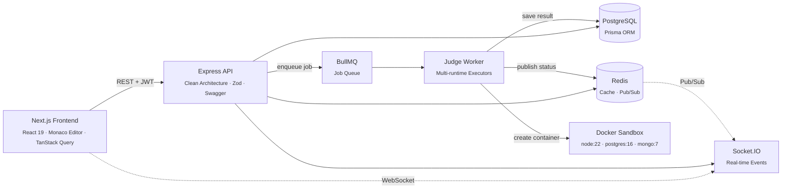
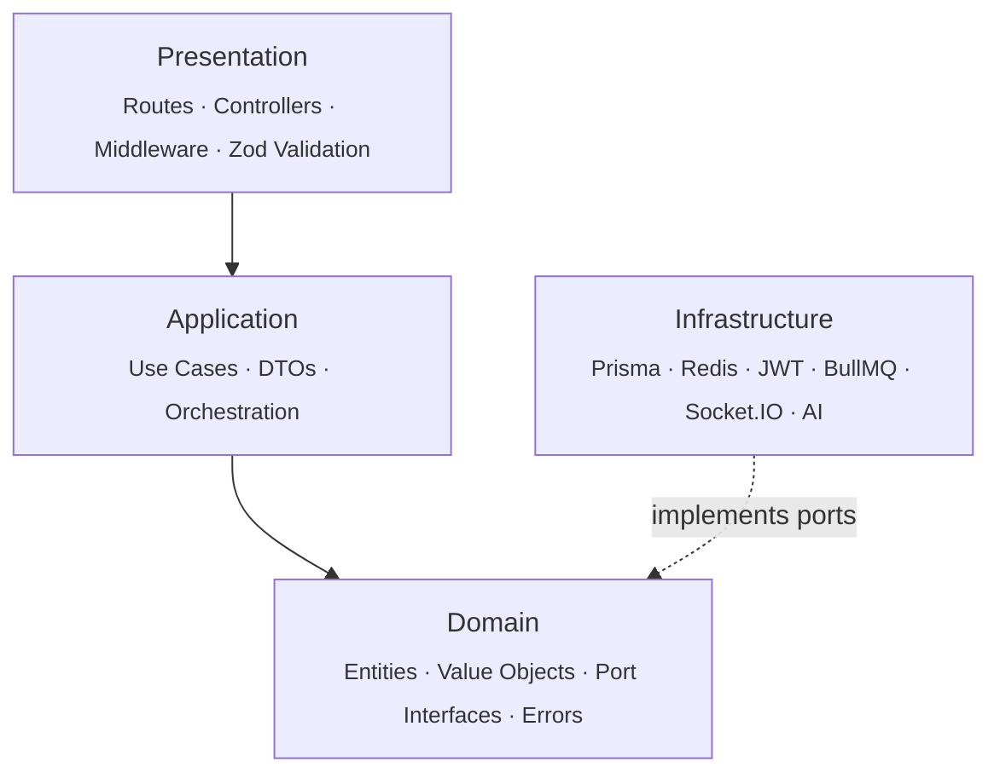
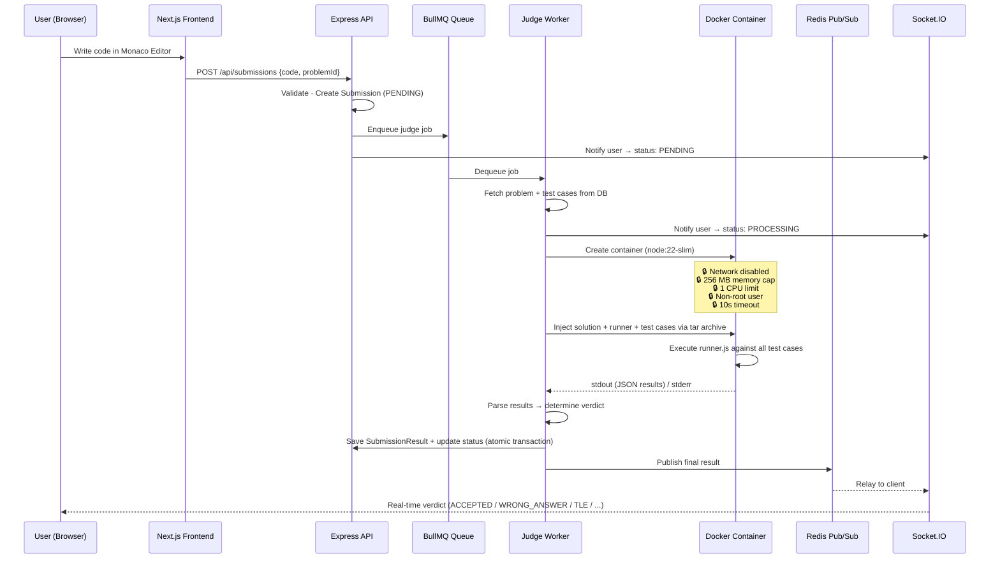

# ⚡ interviewUndo

A production-grade, LeetCode-style interview preparation platform built with **clean architecture** and **sandboxed code execution**. Users solve coding challenges in a full-featured Monaco editor, and their solutions are evaluated inside isolated Docker containers with strict resource limits — all with real-time feedback over WebSockets.

> **JavaScript · React · Node.js · TypeScript · SQL · MongoDB** — six categories, 100+ problems, instant feedback.

---

## Architecture



### Backend Layering (Clean Architecture)

The backend follows **Hexagonal Architecture** (Ports & Adapters). Domain and application layers have zero knowledge of Express, Prisma, or any framework — all external I/O flows through injectable port interfaces.



**Key principles**: dependency inversion, constructor injection via a DI container, framework independence in business logic, and program-against-interfaces for all external actions.

---

## How Code Execution Works

The judge pipeline is the core of the platform. It runs user-submitted code in **fully isolated Docker containers** with strict security and resource constraints.



### Execution Model

| Aspect              | Detail                                                                                                                                                                                                        |
| ------------------- | ------------------------------------------------------------------------------------------------------------------------------------------------------------------------------------------------------------- |
| **Sandbox**         | Each submission spins up a fresh Docker container — no shared state between executions                                                                                                                        |
| **Security**        | Network disabled, non-root user (`node`), 256 MB memory, 1 CPU, 10s hard timeout                                                                                                                              |
| **Multi-runtime**   | Separate executor classes for JavaScript, React (with Vite build), SQL (postgres:16), MongoDB (mongo:7)                                                                                                       |
| **Two modes**       | **Submit** — persists result to DB, updates streaks & stats. **Playground (Run)** — cached in Redis for 5 min, no DB write                                                                                    |
| **Test runner**     | A generated `runner.js` is injected into the container alongside the user's code. It iterates test cases, captures actual vs expected output, measures per-case runtime, and writes structured JSON to stdout |
| **Result pipeline** | Worker determines verdict (`ACCEPTED`, `WRONG_ANSWER`, `RUNTIME_ERROR`, `COMPILATION_ERROR`, `TIME_LIMIT_EXCEEDED`), saves atomically, and publishes via Redis pub/sub → Socket.IO → browser                  |

---

## Key Features

- **Auth** — Email/password (JWT + Argon2), GitHub OAuth, Google OAuth, token refresh
- **Problem Catalog** — Filterable by category, difficulty, and tags with full-text search
- **Daily Challenge** — Automated daily problem rotation via server-side cron
- **AI Hints** — Progressive hint system powered by Grok (xAI) with per-user usage tracking
- **Code Workspace** — Monaco Editor with syntax highlighting, multi-file support (React), and auto-save
- **Real-time Feedback** — Live submission status transitions over Socket.IO (PENDING → PROCESSING → verdict)
- **Dashboard** — Streak tracking, activity heatmap, category progress, difficulty distribution, interview readiness score
- **Admin Panel** — Full CRUD for problems and test cases, platform-wide statistics
- **API Docs** — Interactive Swagger UI at `/api-docs`

---

## Tech Stack

| Layer              | Technologies                                                                                                 |
| ------------------ | ------------------------------------------------------------------------------------------------------------ |
| **Frontend**       | Next.js 16, React 19, TypeScript, Tailwind CSS 4, shadcn/ui, Monaco Editor, TanStack Query, Socket.IO client |
| **Backend**        | Express 5, TypeScript, Clean Architecture, Zod, Swagger/OpenAPI                                              |
| **Database**       | PostgreSQL 16, Prisma 7 ORM                                                                                  |
| **Cache & Queue**  | Redis 7, BullMQ, ioredis                                                                                     |
| **Code Execution** | Docker (Dockerode), dedicated executor per runtime (JS, React, SQL, MongoDB)                                 |
| **Auth**           | jose (JWT), Argon2, next-auth (GitHub + Google OAuth)                                                        |
| **Real-time**      | Socket.IO 4, Redis Pub/Sub                                                                                   |
| **Testing**        | Vitest, Supertest, Playwright                                                                                |
| **Tooling**        | Turborepo, ESLint, Prettier, Husky, lint-staged                                                              |
| **Deployment**     | Vercel (frontend), Render (backend + worker), Supabase/managed Postgres                                      |

---

## Monorepo Structure

```
├── apps/
│   ├── frontend/           Next.js 16 (App Router, React 19)
│   ├── backend-api/        Express 5 API (Clean Architecture)
│   │   └── src/
│   │       ├── domain/         Entities, Value Objects, Port Interfaces, Errors
│   │       ├── application/    Use Cases, DTOs
│   │       ├── infrastructure/ Prisma, Redis, JWT, BullMQ, Socket.IO, AI
│   │       ├── presentation/   Routes, Controllers, Middleware
│   │       └── container/      Dependency Injection wiring
│   └── judge-worker/       BullMQ consumer with sandboxed Docker executors
│       └── src/
│           ├── executor/       JavascriptExecutor, ReactExecutor, SqlExecutor, MongodbExecutor
│           └── worker/         SubmissionWorker (job processor)
├── packages/
│   ├── shared-types/       DTOs, enums, Zod schemas
│   └── shared-utils/       Shared utility functions (streak calculation, etc.)
└── infrastructure/
    ├── docker-compose.yml  Local dev services (Postgres, Redis, Mongo)
    └── docker/             Custom Dockerfiles for SQL/MongoDB/React runners
```

---

## Getting Started

### Prerequisites

- Node.js ≥ 22 &nbsp;·&nbsp; npm ≥ 10 &nbsp;·&nbsp; Docker Desktop

### Quick Start

```bash
git clone https://github.com/YOUR_USERNAME/interviewUndo.git
cd interviewUndo
npm install
cp .env.example .env          # fill in your secrets
docker compose -f infrastructure/docker-compose.yml up -d
npm run db:migrate
npm run db:seed
npm run dev                    # starts all apps via Turborepo
```

| Service     | URL                              |
| ----------- | -------------------------------- |
| Frontend    | `http://localhost:3000`          |
| Backend API | `http://localhost:4000`          |
| Swagger UI  | `http://localhost:4000/api-docs` |

> Environment variables are validated on startup with Zod — if anything is missing, the server fails fast with a clear error. See [`.env.example`](.env.example) for all required values.

---

## Scripts

| Command              | What it does                                  |
| -------------------- | --------------------------------------------- |
| `npm run dev`        | Start all apps in development (Turborepo)     |
| `npm run build`      | Production build across workspaces            |
| `npm run test`       | Unit + integration tests (Vitest + Supertest) |
| `npm run test:e2e`   | End-to-end browser tests (Playwright)         |
| `npm run db:migrate` | Apply Prisma migrations                       |
| `npm run db:seed`    | Seed all problem categories                   |
| `npm run db:studio`  | Open Prisma Studio GUI                        |

---

## API Surface

Full interactive documentation is available at `/api-docs`. Key endpoint groups:

| Group           | Endpoints                                     | Purpose            |
| --------------- | --------------------------------------------- | ------------------ |
| **Auth**        | Register, Login, Refresh, GitHub/Google OAuth | Session management |
| **Problems**    | List, Get by slug, Daily challenge, AI hints  | Problem catalog    |
| **Submissions** | Submit code, Run (playground), Get result     | Code evaluation    |
| **Dashboard**   | Stats, Progress, Heatmap, Recent activity     | User analytics     |
| **Admin**       | Problem CRUD, Test case CRUD, Platform stats  | Content management |
| **Health**      | Liveness, readiness probes                    | Monitoring         |

---

## Testing Strategy

| Layer           | Tool               | Scope                                                          |
| --------------- | ------------------ | -------------------------------------------------------------- |
| **Unit**        | Vitest             | Use cases with mocked port interfaces                          |
| **Integration** | Vitest + Supertest | Route → Controller → Use Case pipeline                         |
| **E2E**         | Playwright         | Full user flows: Register → Login → Solve → Submit → Dashboard |

```bash
npm run test          # unit + integration
npm run test:e2e      # browser E2E
```

---

## Deployment

| Component    | Target                          | Notes                                                |
| ------------ | ------------------------------- | ---------------------------------------------------- |
| Frontend     | **Vercel**                      | Zero-config Next.js deployment                       |
| Backend API  | **Render** (Docker/VPS)         | Configured via [`render.yaml`](render.yaml)          |
| Judge Worker | **Render** (Background Worker)  | Requires Docker-in-Docker or a VM with Docker access |
| PostgreSQL   | **Supabase** / managed Postgres | Production-grade managed DB                          |
| Redis        | **Upstash** / managed Redis     | Required for queues, cache, and pub/sub              |

---

## License

MIT
