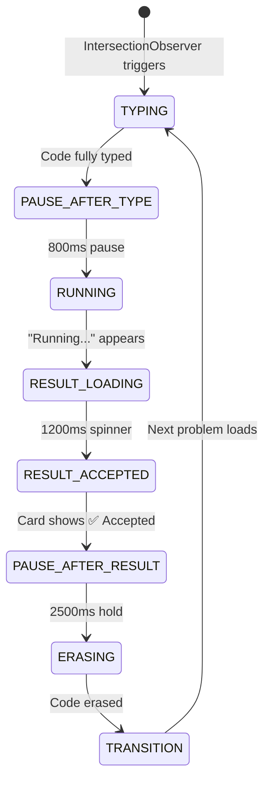
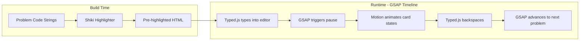

# Landing Page — Code Typing Illusion

Transform the static [product-showcase.tsx](file:///d:/interviewUndo/apps/frontend/src/components/marketing/product-showcase.tsx) into a cinematic, looping animation that simulates a developer solving coding problems in real-time.

## Animation Flow



## Library Responsibilities

Each library handles what it does best — no overlap:

| Library      | Role                                              | What It Controls                                                                      |
| ------------ | ------------------------------------------------- | ------------------------------------------------------------------------------------- |
| **Typed.js** | Character-by-character typing + backspace erasing | Code text appearing/disappearing in the editor panel                                  |
| **Shiki**    | Syntax highlighting                               | Pre-rendering code strings to highlighted HTML tokens at build time                   |
| **GSAP**     | Master timeline orchestration                     | Sequencing all phases, coordinating timing between typing, card, and UI states        |
| **Motion**   | Micro-animations + presence transitions           | Submission card mount/unmount, result reveal, difficulty badge entrance, glow effects |



---

## Open Questions

> [!IMPORTANT]
> **Problem Set**: The current showcase only has "Reverse String". Should I use these 4 problems for the rotation cycle, or do you have a different set in mind?
>
> 1. **Reverse String** (Easy) — `str.split('').reverse().join('')`
> 2. **Two Sum** (Medium) — hash map approach
> 3. **Valid Parentheses** (Medium) — stack approach
> 4. **Palindrome Check** (Easy) — two-pointer approach

> [!IMPORTANT]
> **Typing Speed**: Should the typing feel like a fast developer (~40ms/char) or a more deliberate, readable pace (~70ms/char)? I'll default to **50ms/char** which balances realism and watchability.

> [!IMPORTANT]
> **Scroll Behavior**: Should the animation **only play when visible** (IntersectionObserver pauses when scrolled away), or should it **always loop** regardless of scroll position?

---

## Proposed Changes

### Dependencies

#### Install 4 new packages

```bash
cd apps/frontend
npm install motion gsap typed.js shiki
```

| Package    | Bundle Impact (tree-shaken) |
| ---------- | --------------------------- |
| `motion`   | ~18KB gzipped               |
| `gsap`     | ~25KB gzipped               |
| `typed.js` | ~4KB gzipped                |
| `shiki`    | ~6KB core + lazy grammars   |

---

### Component 1: Shiki Highlighting Utility

#### [NEW] [shiki-highlighter.ts](file:///d:/interviewUndo/apps/frontend/src/lib/shiki-highlighter.ts)

A utility module that pre-generates highlighted HTML from raw code strings using Shiki. Called once on component mount (client-side) to avoid blocking SSR.

**Key details:**

- Uses the `one-dark-pro` theme (matches the dark Fey design system)
- Highlights all problem code strings in a single batch
- Returns HTML strings that Typed.js will type character-by-character
- Shiki's `codeToHtml()` produces `<span style="color:...">` tokens — these will be injected as the typing target

```ts
// Pseudocode
import { createHighlighter } from 'shiki';

const highlighter = await createHighlighter({
  themes: ['one-dark-pro'],
  langs: ['javascript'],
});

export function highlightCode(code: string): string {
  return highlighter.codeToHtml(code, { lang: 'javascript', theme: 'one-dark-pro' });
}
```

---

### Component 2: Problem Data

#### [NEW] [showcase-problems.ts](file:///d:/interviewUndo/apps/frontend/src/components/marketing/showcase-problems.ts)

Static data file containing the problem rotation set. Each problem defines:

```ts
interface ShowcaseProblem {
  title: string;
  difficulty: 'Easy' | 'Medium' | 'Hard';
  description: string;
  example: { input: string; output: string };
  code: string; // raw code string
  highlightedHtml?: string; // populated at runtime by Shiki
  result: {
    status: 'Accepted';
    runtime: string; // e.g. "24 ms"
    memory: string; // e.g. "7 MB"
  };
  breadcrumb: string; // e.g. "Problems → Strings → Reverse String"
}
```

Contains 4 problems: Reverse String, Two Sum, Valid Parentheses, Palindrome Check.

---

### Component 3: The Animated Showcase (Main Component)

#### [MODIFY] [product-showcase.tsx](file:///d:/interviewUndo/apps/frontend/src/components/marketing/product-showcase.tsx)

This is the core change. The current 158-line static component becomes a `'use client'` animated component. The existing layout structure (sidebar, top bar, problem panel, code editor, stat widgets) is **preserved** — only the dynamic panels change.

**What stays static (no animation):**

- Sidebar with menu items and user profile (lines 24–48)
- Top bar with traffic lights and breadcrumb (lines 7–19) — breadcrumb text updates per problem
- Floating widgets grid at the bottom (lines 122–154)

**What becomes dynamic:**

##### A. Code Editor Panel (right side, lines 92–117)

- **Typed.js** types the Shiki-highlighted HTML character by character into this panel
- The raw `<span>` markup from Shiki is injected as `contentType: 'html'` in Typed.js config
- A blinking cursor (Typed.js built-in) appears at the typing position
- Backspace animation erases the code before loading the next problem
- The file tab updates (`solution.js` stays, language badge stays)

##### B. Problem Description Panel (left side, lines 50–88)

- Problem title, difficulty badge, description, and example update per problem
- **Motion** `AnimatePresence` handles the crossfade between problems
- Difficulty badge uses Motion's `initial/animate` for a pop-in effect

##### C. Submission Result Card (inside problem panel, lines 71–87)

- This card transitions through 3 states, orchestrated by **GSAP** timeline, animated by **Motion**:

| State        | Visual                                    | Motion Animation                                              |
| ------------ | ----------------------------------------- | ------------------------------------------------------------- |
| **Hidden**   | Card not visible                          | —                                                             |
| **Running**  | Pulsing "Running..." with spinner         | `motion.div` fade in + `animate-spin` on icon                 |
| **Accepted** | Green ✅ card with runtime/memory metrics | `motion.div` spring scale-up + staggered children for metrics |

```tsx
<AnimatePresence mode="wait">
  {phase === 'RUNNING' && (
    <motion.div
      key="running"
      initial={{ opacity: 0, y: 8 }}
      animate={{ opacity: 1, y: 0 }}
      exit={{ opacity: 0, y: -8 }}
      transition={{ duration: 0.3 }}
    >
      <Loader2 className="animate-spin" /> Running...
    </motion.div>
  )}
  {phase === 'RESULT' && (
    <motion.div
      key="result"
      initial={{ opacity: 0, scale: 0.95 }}
      animate={{ opacity: 1, scale: 1 }}
      transition={{ type: 'spring', stiffness: 300, damping: 24 }}
    >
      ✅ Accepted — Runtime: 24ms — Memory: 7MB
    </motion.div>
  )}
</AnimatePresence>
```

##### D. Breadcrumb (top bar)

- Updates text per problem (e.g., "Problems → Strings → Reverse String" → "Problems → Arrays → Two Sum")
- Simple text swap, no animation needed

##### E. Execution Badge (bottom-right of editor, line 113–116)

- Pulses green during "Running" phase (already has `animate-pulse`)
- **Motion** adds a brief glow burst when result arrives

**GSAP Timeline Structure:**

```ts
// Pseudocode — the master timeline
const tl = gsap.timeline({ repeat: -1, onRepeat: advanceToNextProblem });

// Phase 1: Typing (duration controlled by Typed.js callback)
tl.call(() => startTyping(), [], 0);
tl.addPause('typingDone'); // resumed by Typed.js onComplete

// Phase 2: Pause after typing
tl.to({}, { duration: 0.8 }, 'typingDone');

// Phase 3: Show "Running..."
tl.call(() => setPhase('RUNNING'));
tl.to({}, { duration: 1.2 });

// Phase 4: Show result
tl.call(() => setPhase('RESULT'));
tl.to({}, { duration: 2.5 });

// Phase 5: Erase code (Typed.js backspace)
tl.call(() => startErasing());
tl.addPause('erasingDone'); // resumed by Typed.js onComplete

// Phase 6: Transition to next problem
tl.call(() => {
  setPhase('HIDDEN');
  loadNextProblem();
});
tl.to({}, { duration: 0.5 });
```

---

### Component 4: CSS Additions

#### [MODIFY] [globals.css](file:///d:/interviewUndo/apps/frontend/src/app/globals.css)

Add a few utility classes for the showcase:

```css
/* Blinking cursor for code editor */
@keyframes blink-caret {
  0%,
  100% {
    opacity: 1;
  }
  50% {
    opacity: 0;
  }
}

.showcase-cursor {
  animation: blink-caret 1s step-end infinite;
}

/* Shiki overrides to match Fey design */
.showcase-editor .shiki {
  background: transparent !important;
  font-family: var(--font-geist-mono);
  font-size: 0.875rem;
  line-height: 1.75;
}

/* Glow pulse on result arrival */
@keyframes glow-pulse {
  0% {
    box-shadow: 0 0 0 rgba(78, 190, 150, 0);
  }
  50% {
    box-shadow: 0 0 20px rgba(78, 190, 150, 0.3);
  }
  100% {
    box-shadow: 0 0 0 rgba(78, 190, 150, 0);
  }
}

.result-glow {
  animation: glow-pulse 0.8s ease-out;
}
```

---

### Component 5: Landing Page Integration

#### [MODIFY] [page.tsx](file:///d:/interviewUndo/apps/frontend/src/app/page.tsx)

No structural changes needed — `ProductShowcase` is already imported. The component just becomes interactive internally.

---

## File Summary

| File                                                                                                         | Action     | Description                                                        |
| ------------------------------------------------------------------------------------------------------------ | ---------- | ------------------------------------------------------------------ |
| [shiki-highlighter.ts](file:///d:/interviewUndo/apps/frontend/src/lib/shiki-highlighter.ts)                  | **NEW**    | Shiki utility for pre-highlighting code                            |
| [showcase-problems.ts](file:///d:/interviewUndo/apps/frontend/src/components/marketing/showcase-problems.ts) | **NEW**    | Problem data (4 problems with code, metadata, results)             |
| [product-showcase.tsx](file:///d:/interviewUndo/apps/frontend/src/components/marketing/product-showcase.tsx) | **MODIFY** | Convert to animated client component with GSAP + Typed.js + Motion |
| [globals.css](file:///d:/interviewUndo/apps/frontend/src/app/globals.css)                                    | **MODIFY** | Add cursor blink, Shiki theme overrides, glow animation            |
| [page.tsx](file:///d:/interviewUndo/apps/frontend/src/app/page.tsx)                                          | No change  | Already imports ProductShowcase                                    |

---

## Verification Plan

### Automated Tests

- `cd apps/frontend && npx next build` — Verify the build compiles with no errors (SSR compatibility, no hydration mismatches)

### Manual Verification

1. Run `npm run dev` and navigate to `/` (landing page)
2. Verify the full animation cycle:
   - Code types character by character with syntax highlighting
   - Blinking cursor visible during typing
   - "Running..." appears with loading spinner after typing completes
   - Result card animates in with ✅ Accepted, runtime, memory
   - Code erases character by character
   - Next problem loads and cycle repeats
3. Verify the animation pauses when scrolled out of view
4. Verify no layout shift — static elements (sidebar, widgets) remain stable
5. Verify mobile responsiveness — editor panel hides on `< lg` (existing behavior preserved)
6. Check browser DevTools Performance tab — no jank, 60fps animations
